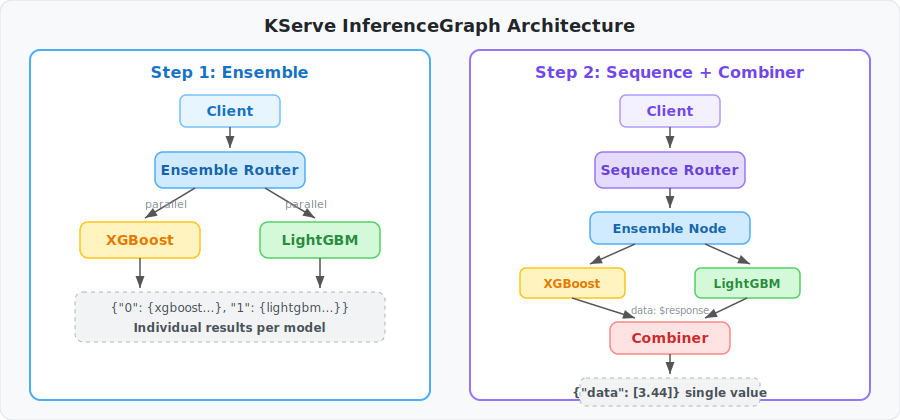
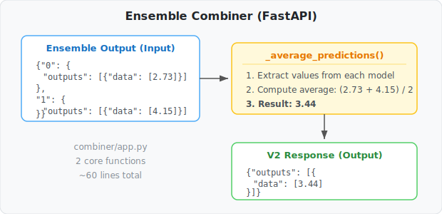

# Deploying Ensemble Models with KServe InferenceGraph

> *Read this in other languages: [한국어](BLOG_KO.md)*
>
> Wire multiple ML models into a pipeline with a single YAML, and add a Combiner to merge results

## Problem: How to Serve 2 Models Together?

We wanted to predict house prices using the California Housing dataset with both XGBoost and LightGBM. Averaging their predictions improves accuracy by about 2% over either model alone.

| Model | MSE | R² Score |
| ----- | --- | -------- |
| XGBoost | 0.2273 | 0.8266 |
| LightGBM | 0.2246 | 0.8286 |
| **Ensemble (Average)** | **0.2223** | **0.8303** |

The challenge is deployment. Running separate services with an API Gateway adds infrastructure complexity. Bundling both into one container prevents independent scaling.

## Solution: KServe InferenceGraph

KServe InferenceGraph connects multiple InferenceServices **via YAML**. Two core routers:

- **Ensemble** — sends the same input to multiple models in parallel, collects results
- **Sequence** — executes steps in order, passes previous results to the next step

### Using Ensemble Only



```yaml
spec:
  nodes:
    root:
      routerType: Ensemble
      steps:
        - serviceName: xgboost-predictor
        - serviceName: lightgbm-predictor
```

A single request returns results from both models **simultaneously**:

```json
{
  "0": {"model_name": "xgboost-predictor", "outputs": [{"data": [2.7366]}]},
  "1": {"model_name": "lightgbm-predictor", "outputs": [{"data": [4.1576]}]}
}
```

Clients can compare predictions or use them selectively.

### Merging on the Server: Sequence + Combiner

```yaml
spec:
  nodes:
    root:
      routerType: Sequence
      steps:
        - nodeName: ensemble-node
        - serviceUrl: http://ensemble-combiner-.../v2/models/ensemble-combiner/infer
          data: $response    # key: pass previous step's output to next
    ensemble-node:
      routerType: Ensemble
      steps:
        - serviceName: xgboost-predictor
        - serviceName: lightgbm-predictor
```

`data: $response` is the key setting. Without it, the combiner receives the original input instead of the ensemble results.

## How Simple is the Combiner?



One FastAPI app, 2 core functions, ~60 lines total:

```python
def _average_predictions(body: dict) -> float:
    predictions = []
    for key in sorted(body.keys()):
        step = body[key]
        if isinstance(step, dict) and "outputs" in step:
            predictions.append(float(step["outputs"][0]["data"][0]))
    return sum(predictions) / len(predictions)
```

It receives the Ensemble output as-is and averages the values. To switch to weighted averaging or max selection, just modify this one function.

## Try It Yourself

```bash
# 1. Prepare (Kind cluster + KServe + model training + Combiner build)
./scripts/1.prepare.sh

# 2. Deploy
./scripts/2.deploy.sh

# 3. Test
kubectl port-forward -n ingress-nginx svc/ingress-nginx-controller 8080:80 &

curl -s -X POST \
  -H "Content-Type: application/json" \
  -H "Host: housing-price-graph.127.0.0.1.sslip.io" \
  -d @data/inference_request.json \
  http://localhost:8080/v2/models/housing-price-graph/infer | jq '.'
```

For a detailed step-by-step guide, see [TUTORIAL.md](TUTORIAL.md).

## Key Takeaways

| Setting | Role |
| ------- | ---- |
| `routerType: Ensemble` | Parallel requests to multiple models, collect results |
| `routerType: Sequence` | Execute steps in order |
| `data: $response` | Pass previous step's output to the next step |
| `serviceUrl` | Specify a V2 endpoint directly |

With InferenceGraph, you can build model pipelines using just YAML — no infrastructure code required.
