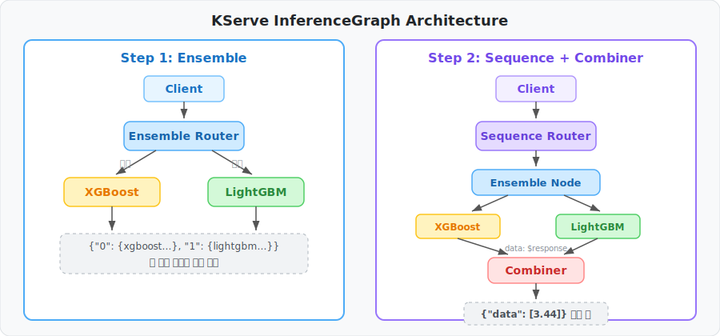
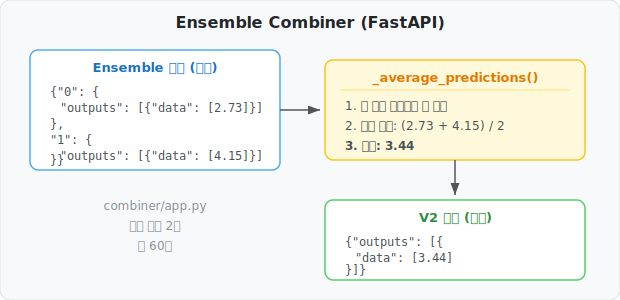

# KServe InferenceGraph로 앙상블 모델 배포하기

> *Read this in other languages: [English](BLOG.md)*
>
> 여러 ML 모델을 YAML 한 장으로 파이프라인 구성하고, 결과를 합치는 Combiner까지 붙이는 방법

## 문제: 모델이 2개인데 어떻게 서비스하지?

California Housing 데이터셋으로 집값을 예측하는데, XGBoost와 LightGBM 두 모델을 함께 쓰고 싶었습니다. 두 모델의 예측값을 평균내면 단일 모델보다 약 2% 정확도가 올라가거든요.

| 모델 | MSE | R² Score |
| ---- | --- | -------- |
| XGBoost | 0.2273 | 0.8266 |
| LightGBM | 0.2246 | 0.8286 |
| **앙상블 (평균)** | **0.2223** | **0.8303** |

문제는 배포입니다. 각 모델을 별도 서비스로 띄우고 API Gateway에서 합치자니 인프라가 복잡해지고, 하나의 컨테이너에 다 넣자니 개별 스케일링이 안 됩니다.

## 해결: KServe InferenceGraph

KServe InferenceGraph는 여러 InferenceService를 **YAML로 연결**하는 기능입니다. 두 가지 핵심 라우터:

- **Ensemble** — 동일한 입력을 여러 모델에 병렬 전달, 결과 수집
- **Sequence** — 단계를 순서대로 실행, 이전 결과를 다음 단계에 전달

### Ensemble만 사용하면?



```yaml
spec:
  nodes:
    root:
      routerType: Ensemble
      steps:
        - serviceName: xgboost-predictor
        - serviceName: lightgbm-predictor
```

하나의 요청으로 두 모델의 결과를 **동시에** 받습니다:

```json
{
  "0": {"model_name": "xgboost-predictor", "outputs": [{"data": [2.7366]}]},
  "1": {"model_name": "lightgbm-predictor", "outputs": [{"data": [4.1576]}]}
}
```

클라이언트가 각 모델 결과를 비교하거나 선택적으로 사용할 수 있습니다.

### 서버에서 합치고 싶다면: Sequence + Combiner

```yaml
spec:
  nodes:
    root:
      routerType: Sequence
      steps:
        - nodeName: ensemble-node
        - serviceUrl: http://ensemble-combiner-.../v2/models/ensemble-combiner/infer
          data: $response    # 핵심: 이전 step 결과를 다음에 전달
    ensemble-node:
      routerType: Ensemble
      steps:
        - serviceName: xgboost-predictor
        - serviceName: lightgbm-predictor
```

`data: $response`가 핵심입니다. 이 설정이 없으면 combiner에 원본 입력이 그대로 전달됩니다.

## Combiner는 얼마나 간단할까?



FastAPI 앱 하나, 핵심 함수 2개, 총 60줄입니다:

```python
def _average_predictions(body: dict) -> float:
    predictions = []
    for key in sorted(body.keys()):
        step = body[key]
        if isinstance(step, dict) and "outputs" in step:
            predictions.append(float(step["outputs"][0]["data"][0]))
    return sum(predictions) / len(predictions)
```

Ensemble 출력을 그대로 받아서 평균을 냅니다. 가중 평균이나 최대값 선택으로 바꾸려면 이 함수만 수정하면 됩니다.

## 직접 해보기

```bash
# 1. 준비 (Kind 클러스터 + KServe + 모델 훈련 + Combiner 빌드)
./scripts/1.prepare.sh

# 2. 배포
./scripts/2.deploy.sh

# 3. 테스트
kubectl port-forward -n ingress-nginx svc/ingress-nginx-controller 8080:80 &

curl -s -X POST \
  -H "Content-Type: application/json" \
  -H "Host: housing-price-graph.127.0.0.1.sslip.io" \
  -d @data/inference_request.json \
  http://localhost:8080/v2/models/housing-price-graph/infer | jq '.'
```

자세한 단계별 가이드는 [TUTORIAL_KO.md](TUTORIAL_KO.md)를 참조하세요.

## 핵심 정리

| 설정 | 역할 |
| ---- | ---- |
| `routerType: Ensemble` | 여러 모델에 병렬 요청, 결과 수집 |
| `routerType: Sequence` | 단계를 순서대로 실행 |
| `data: $response` | 이전 step 결과를 다음 step에 전달 |
| `serviceUrl` | 특정 V2 엔드포인트 직접 지정 |

InferenceGraph를 쓰면 모델 파이프라인을 인프라 코드 없이 YAML만으로 구성할 수 있습니다.
