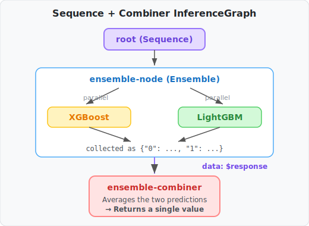

# KServe InferenceGraph Hands-on Tutorial

> *Read this in other languages: [한국어](TUTORIAL_KO.md)*

This tutorial walks through the core features of KServe **InferenceGraph** step by step.

- **Step 1**: Send a single request to multiple models via Ensemble router and inspect the response
- **Step 2**: Add Sequence + Combiner to merge results into a single value

Uses XGBoost/LightGBM models trained on the California Housing dataset.

## Architecture Overview


## Table of Contents

1. [Prerequisites](#1-prerequisites)
2. [Deploy](#2-deploy)
3. [Using Ensemble Only](#3-using-ensemble-only)
4. [Combining Results with Sequence + Combiner](#4-combining-results-with-sequence--combiner)
5. [Cleanup](#5-cleanup)

---

## 1. Prerequisites

```bash
./scripts/1.prepare.sh
```

This script automatically:

1. Creates a Kind cluster + installs Nginx Ingress
2. Installs KServe v0.17.0 + configures Nginx Ingress
3. Installs Python packages + trains models (XGBoost, LightGBM)
4. Builds the Ensemble Combiner image + loads it into Kind

---

## 2. Deploy

```bash
./scripts/2.deploy.sh
```

Verify deployment status:

```bash
kubectl get isvc -n kserve-graph-demo
kubectl get ig -n kserve-graph-demo
```

Ensure all services show `READY = True`.

Set up port-forward:

```bash
kubectl port-forward -n ingress-nginx svc/ingress-nginx-controller 8080:80 &
```

---

## 3. Using Ensemble Only

### 3.1 What is the Ensemble Router?

The Ensemble router sends **the same input to multiple models in parallel** and **collects** each model's results.

```text
root (Ensemble)
  ├→ xgboost-predictor  (parallel)
  └→ lightgbm-predictor (parallel)
```

**Key point:** A single request returns results from multiple models simultaneously. Clients can compare predictions or selectively use each model's output.

### 3.2 Deploy Ensemble-only InferenceGraph

```bash
cat > /tmp/ensemble-only.yaml <<EOF
apiVersion: serving.kserve.io/v1alpha1
kind: InferenceGraph
metadata:
  name: housing-price-graph
  namespace: kserve-graph-demo
spec:
  nodes:
    root:
      routerType: Ensemble
      steps:
        - serviceName: xgboost-predictor
        - serviceName: lightgbm-predictor
EOF

kubectl apply -f /tmp/ensemble-only.yaml
```

Wait for the IG router pod to update:

```bash
kubectl rollout status deployment/housing-price-graph -n kserve-graph-demo --timeout=60s
```

### 3.3 Send a Request

```bash
curl -s -X POST \
  -H "Content-Type: application/json" \
  -H "Host: housing-price-graph.127.0.0.1.sslip.io" \
  -d @data/inference_request.json \
  http://localhost:8080/v2/models/housing-price-graph/infer | jq '.'
```

### 3.4 Inspect the Ensemble Response

```json
{
  "0": {
    "model_name": "xgboost-predictor",
    "outputs": [
      { "name": "predict", "datatype": "FP32", "shape": [1, 1], "data": [2.7366] }
    ]
  },
  "1": {
    "model_name": "lightgbm-predictor",
    "outputs": [
      { "name": "predict", "datatype": "FP64", "shape": [1, 1], "data": [4.1576] }
    ]
  }
}
```

A single request returned results from both models simultaneously. Clients can compare predictions or use them individually.

What if you want the server to **merge these results into a single value** before returning? The next section uses Sequence + Combiner.

---

## 4. Combining Results with Sequence + Combiner

### 4.1 Sequence + Combiner Architecture

To merge Ensemble results into a single value on the server side:

1. **Sequence** router chains the steps
2. **Combiner service** receives ensemble results and computes the average



### 4.2 Deploy Sequence + Combiner InferenceGraph

```bash
kubectl apply -f k8s/inferencegraph/housing-price-graph.yaml
```

Key configuration in this YAML:

```yaml
spec:
  nodes:
    root:
      routerType: Sequence
      steps:
        - nodeName: ensemble-node
        - serviceUrl: http://ensemble-combiner-predictor..../v2/models/ensemble-combiner/infer
          data: $response    # pass ensemble results to combiner
    ensemble-node:
      routerType: Ensemble
      steps:
        - serviceName: xgboost-predictor
        - serviceName: lightgbm-predictor
```

- `data: $response` — passes the previous step's (ensemble) output as input to the next step (combiner). Without this, the original input is forwarded instead.
- `serviceUrl` — specifies the combiner's V2 endpoint directly

Wait for the IG router pod to update:

```bash
kubectl rollout status deployment/housing-price-graph -n kserve-graph-demo --timeout=60s
```

### 4.3 Send a Request

```bash
curl -s -X POST \
  -H "Content-Type: application/json" \
  -H "Host: housing-price-graph.127.0.0.1.sslip.io" \
  -d @data/inference_request.json \
  http://localhost:8080/v2/models/housing-price-graph/infer | jq '.'
```

### 4.4 Inspect the Combiner Response

```json
{
  "id": "a1b2c3d4-...",
  "model_name": "ensemble-combiner",
  "outputs": [
    {
      "name": "predict",
      "shape": [1, 1],
      "datatype": "FP64",
      "data": [3.4471]
    }
  ]
}
```

The **average** of XGBoost (2.7366) and LightGBM (4.1576) is returned as a single value (3.4471).

### 4.5 Combiner Code Structure

The Combiner is a simple FastAPI app. The core is just two functions:


```python
def _average_predictions(body: dict) -> float:
    predictions = []
    for key in sorted(body.keys()):       # iterate over "0", "1", ... model results
        step = body[key]
        if isinstance(step, dict) and "outputs" in step:
            value = step["outputs"][0]["data"][0]
            predictions.append(float(value))
    return sum(predictions) / len(predictions)
```

It simply receives the Ensemble output (`{"0": {...}, "1": {...}}`) and averages the values. You can easily replace this with weighted averaging, max selection, etc.

### 4.6 Comparison

| Configuration | Response Format | Client Post-processing |
| ------------- | --------------- | ---------------------- |
| Ensemble only | `{"0": {...}, "1": {...}}` | Use each model's result individually |
| Sequence + Combiner | `{"outputs": [{"data": [3.4471]}]}` | Use the combined value directly |

---

## 5. Cleanup

```bash
./scripts/cleanup.sh
```

---

## Summary

| Router Type | Role |
| ----------- | ---- |
| **Ensemble** | Sends requests to multiple models in parallel, collects results |
| **Sequence** | Executes steps in order, passes previous result via `data: $response` |

**Key settings:**

- `data: $response` — forwards the previous step's output to the next step in a Sequence
- `serviceUrl` — specifies a particular endpoint (e.g., V2) directly
