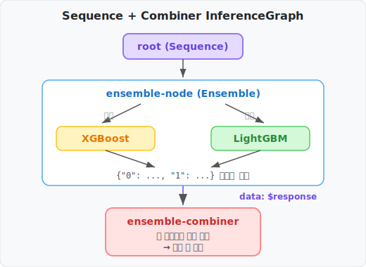

# KServe InferenceGraph 실전 튜토리얼

> *Read this in other languages: [English](TUTORIAL.md)*

이 튜토리얼은 KServe **InferenceGraph**의 핵심 기능을 단계별로 배웁니다.

- **Step 1**: Ensemble 라우터로 여러 모델을 병렬 호출하면 어떤 응답이 오는지 확인
- **Step 2**: Sequence + Combiner를 추가하여 결과를 하나로 합치는 방법

California Housing 데이터셋의 XGBoost/LightGBM 두 모델을 예제로 사용합니다.

## 전체 구조


## 목차
1. [사전 준비](#1-사전-준비)
2. [배포](#2-배포)
3. [Ensemble만 사용하기](#3-ensemble만-사용하기)
4. [Sequence + Combiner로 결과 합치기](#4-sequence--combiner로-결과-합치기)
5. [정리](#5-정리)

---

## 1. 사전 준비

```bash
./scripts/1.prepare.sh
```

이 스크립트는 자동으로:
1. Kind 클러스터 생성 + Nginx Ingress 설치
2. KServe v0.17.0 설치 + Nginx Ingress 설정
3. Python 패키지 설치 + 모델 훈련 (XGBoost, LightGBM)
4. Ensemble Combiner 이미지 빌드 + Kind에 로드

---

## 2. 배포

```bash
./scripts/2.deploy.sh
```

배포 완료 후 상태 확인:

```bash
kubectl get isvc -n kserve-graph-demo
kubectl get ig -n kserve-graph-demo
```

모든 서비스가 `READY = True`인지 확인합니다.

포트포워드 설정:

```bash
kubectl port-forward -n ingress-nginx svc/ingress-nginx-controller 8080:80 &
```

---

## 3. Ensemble만 사용하기

### 3.1 Ensemble 라우터란?

Ensemble 라우터는 여러 모델에 **동일한 입력을 병렬로** 전달하고, 각 모델의 결과를 **수집**합니다.

```
root (Ensemble)
  ├→ xgboost-predictor  (병렬)
  └→ lightgbm-predictor (병렬)
```

**핵심 포인트:** 하나의 요청으로 여러 모델의 결과를 동시에 받을 수 있습니다. 클라이언트는 각 모델의 예측값을 비교하거나, 필요에 따라 선택적으로 사용할 수 있습니다.

### 3.2 Ensemble 전용 InferenceGraph 배포

```bash
cat > /tmp/ensemble-only.yaml <<EOF
apiVersion: serving.kserve.io/v1alpha1
kind: InferenceGraph
metadata:
  name: housing-price-graph
  namespace: kserve-graph-demo
spec:
  nodes:
    root:
      routerType: Ensemble
      steps:
        - serviceName: xgboost-predictor
        - serviceName: lightgbm-predictor
EOF

kubectl apply -f /tmp/ensemble-only.yaml
```

IG router pod가 갱신될 때까지 대기:

```bash
kubectl rollout status deployment/housing-price-graph -n kserve-graph-demo --timeout=60s
```

### 3.3 요청 보내기

```bash
curl -s -X POST \
  -H "Content-Type: application/json" \
  -H "Host: housing-price-graph.127.0.0.1.sslip.io" \
  -d @data/inference_request.json \
  http://localhost:8080/v2/models/housing-price-graph/infer | jq '.'
```

### 3.4 Ensemble 응답 확인

```json
{
  "0": {
    "model_name": "xgboost-predictor",
    "outputs": [
      { "name": "predict", "datatype": "FP32", "shape": [1, 1], "data": [2.7366] }
    ]
  },
  "1": {
    "model_name": "lightgbm-predictor",
    "outputs": [
      { "name": "predict", "datatype": "FP64", "shape": [1, 1], "data": [4.1576] }
    ]
  }
}
```

하나의 요청으로 두 모델의 결과를 동시에 받았습니다. 클라이언트는 각 모델의 예측값을 비교하거나 개별적으로 활용할 수 있습니다.

만약 서버 측에서 이 결과들을 **하나의 값으로 합쳐서** 반환하고 싶다면? 다음 섹션에서 Sequence + Combiner를 사용합니다.

---

## 4. Sequence + Combiner로 결과 합치기

### 4.1 Sequence + Combiner 구조

Ensemble 결과를 서버 측에서 하나의 값으로 합치려면:

1. **Sequence** 라우터로 단계를 연결
2. **Combiner 서비스**가 ensemble 결과를 받아 평균을 계산



### 4.2 Sequence + Combiner InferenceGraph 배포

```bash
kubectl apply -f k8s/inferencegraph/housing-price-graph.yaml
```

이 YAML의 핵심 설정:

```yaml
spec:
  nodes:
    root:
      routerType: Sequence
      steps:
        - nodeName: ensemble-node
        - serviceUrl: http://ensemble-combiner-predictor..../v2/models/ensemble-combiner/infer
          data: $response    # ensemble 결과를 combiner에 전달
    ensemble-node:
      routerType: Ensemble
      steps:
        - serviceName: xgboost-predictor
        - serviceName: lightgbm-predictor
```

- `data: $response` - 이전 step(ensemble)의 출력을 다음 step(combiner)의 입력으로 전달 (기본값은 원본 입력을 전달)
- `serviceUrl` - combiner의 V2 엔드포인트를 직접 지정

IG router pod가 갱신될 때까지 대기:

```bash
kubectl rollout status deployment/housing-price-graph -n kserve-graph-demo --timeout=60s
```

### 4.3 요청 보내기

```bash
curl -s -X POST \
  -H "Content-Type: application/json" \
  -H "Host: housing-price-graph.127.0.0.1.sslip.io" \
  -d @data/inference_request.json \
  http://localhost:8080/v2/models/housing-price-graph/infer | jq '.'
```

### 4.4 Combiner 응답 확인

```json
{
  "id": "a1b2c3d4-...",
  "model_name": "ensemble-combiner",
  "outputs": [
    {
      "name": "predict",
      "shape": [1, 1],
      "datatype": "FP64",
      "data": [3.4471]
    }
  ]
}
```

XGBoost(2.7366)와 LightGBM(4.1576)의 **평균값**(3.4471)이 단일 값으로 반환됩니다.

### 4.5 Combiner 코드 구조

Combiner는 간단한 FastAPI 앱입니다. 핵심은 두 개의 함수뿐입니다:


```python
def _average_predictions(body: dict) -> float:
    predictions = []
    for key in sorted(body.keys()):       # "0", "1", ... 각 모델 결과 순회
        step = body[key]
        if isinstance(step, dict) and "outputs" in step:
            value = step["outputs"][0]["data"][0]
            predictions.append(float(value))
    return sum(predictions) / len(predictions)
```

Ensemble 출력을 그대로 받아서 평균을 내는 것이 전부입니다. 가중 평균, 최대값 선택 등으로 쉽게 교체할 수 있습니다.

### 4.6 비교 정리

| 구성 | 응답 형식 | 클라이언트 후처리 |
| ---- | -------- | ----------------- |
| Ensemble만 | `{"0": {...}, "1": {...}}` | 각 모델 결과를 개별 활용 |
| Sequence + Combiner | `{"outputs": [{"data": [3.4471]}]}` | 합산된 단일 값을 바로 사용 |

---

## 5. 정리

```bash
./scripts/cleanup.sh
```

---

## 요약

| 라우터 타입 | 역할 |
| ----------- | ---- |
| **Ensemble** | 여러 모델에 병렬로 요청, 결과를 수집 |
| **Sequence** | 단계를 순서대로 실행, `data: $response`로 이전 결과 전달 |

**핵심 설정:**

- `data: $response` — Sequence에서 이전 step 결과를 다음 step에 전달
- `serviceUrl` — 특정 엔드포인트(V2 등)를 직접 지정
